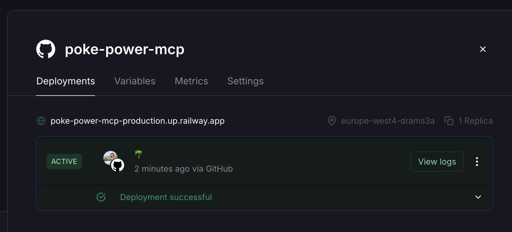
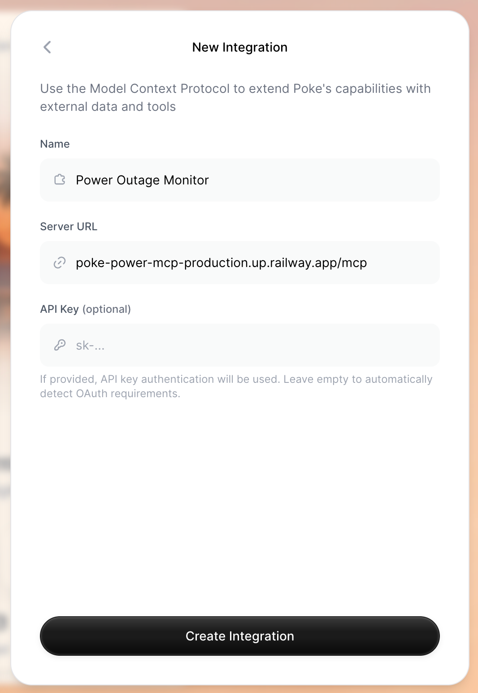

# Poke PGE Power Monitoring

[](https://railway.com/deploy/z1OZTu?referralCode=6bP-D_&utm_medium=integration&utm_source=template&utm_campaign=generic)

Power outage monitoring for [PGE (Polska Grupa Energetyczna)](https://www.gkpge.pl/). Uses the public API at `power-outage.gkpge.pl` to check for scheduled outages in your area.

> **Note:** This only works for areas served by PGE in Poland.

## How it works with Poke

This is built for [Poke](https://poke.com). When the cron job detects a change in power outage status, it sends a webhook to Poke's API. Poke AI then messages you with the update - so you get notified automatically when there's a new outage or when one gets resolved.

The MCP server lets Poke AI query the current outage status on demand.

## Project structure

```
cron-job/     # Checks outages every 5 min, webhooks Poke on changes
mcp/          # HTTP MCP server for AI assistants
```

## Environment variables

| Variable                | Description                          |
| ----------------------- | ------------------------------------ |
| `POWER_OUTAGE_LOCATION` | Location to monitor (e.g. `rajskie`) |
| `REDIS_URL`             | Redis connection URL                 |
| `POKE_API_KEY`          | API key for webhook (cron only)      |

## Local testing

```bash
# MCP server
cd mcp && bun install
POWER_OUTAGE_LOCATION=rajskie bun run index.ts

# Test it
curl http://localhost:8080/health
```

## Railway deployment

1. Add Redis from the database templates
2. Create two services from this repo:
   - **Cron**: root directory `cron-job/`
   - **MCP**: root directory `mcp/`
3. Set shared variables: `REDIS_URL=${{Redis.REDIS_URL}}`, `POWER_OUTAGE_LOCATION`
4. Enable public networking on MCP service

## Connecting to Poke

1. Copy your MCP server URL from Railway (under the MCP service's public domain) and add `/mcp` to the end:

   

2. Add it as an integration in Poke at [Settings → Connections → Integrations](https://poke.com/settings/connections/integrations/new):

   
